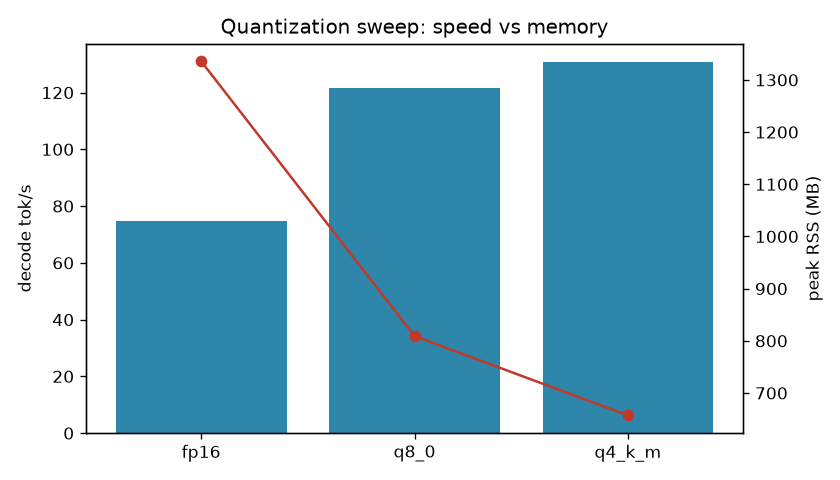

# llm-inference-lab

A small, **reproducible** harness for measuring and optimizing LLM inference. Serve a model, measure it honestly (latency, throughput, memory), sweep an optimization, and get a before → after table you can trust and re-run.

Built to answer a concrete question — *what does quantization actually buy you?* — with real numbers instead of folklore.

## Results — Qwen2.5-0.5B-Instruct on an Apple M3 (Metal)

Quantization sweep, 3 prompts × 128 tokens each, `seed=7`. Every variant measured in its **own process** so the memory number is that variant alone.

| variant | decode tok/s | TTFT ms | peak RSS MB | model on disk MB |
|---|---|---|---|---|
| fp16   | 74.8  | 35.8 | 1336 | 1208 |
| q8_0   | 121.6 | 26.4 | 809  | 644  |
| q4_k_m | 130.7 | 25.9 | 657  | 469  |



**Reading it:**
- **q4_k_m decodes 1.75× faster than fp16 while using ~half the RAM** (657 vs 1336 MB) and 2.6× less disk.
- **q8_0 is the sweet spot here**: within 8% of q4's speed, near-lossless quality, 809 MB.
- Why: token *decode* is memory-bandwidth-bound, so shrinking the weights speeds it up. On a 0.5B model the gaps are already clear; they widen on larger models (see Roadmap).

## How it measures (the part that matters)

A benchmark is only worth the honesty of its measurement. Two decisions here:

1. **Per-variant process isolation.** A first version ran all variants in one process and reported peak RSS from `getrusage` — which returns the *whole process* lifetime peak, so every variant showed the same 1294 MB. That's a lie. `--isolate` runs each variant in a fresh process, so peak RSS reflects that variant only. The numbers above use it.
2. **Reproducible by construction.** The model, prompts, generation params, and seed live in a config file; dependencies are pinned in `uv.lock`; one command reproduces the table. Nothing is measured by hand.

`decode tok/s` is tokens after the first divided by decode time, `(generated_tokens - 1) / (total_s - ttft_s)` — prefill is excluded so it reflects steady-state generation.

## Architecture

The measurement layer never touches the engine, so the same harness runs on Metal today and NVIDIA/CUDA later by swapping one file.

```
config (YAML) → runner → Backend.generate() → raw timings → metrics → results (JSON) → table + plot
                              ↑
              fake (tests) · llama.cpp (Metal) · [CUDA / vLLM — next]
```

- `backends/base.py` — `Backend` protocol + `GenerationResult`
- `backends/fake.py` — deterministic backend for tests (no model needed)
- `backends/llama_cpp.py` — real engine, streams tokens to capture true TTFT
- `metrics.py` — pure, unit-tested functions (throughput, TTFT, output similarity, aggregation)
- `runner.py` — orchestration, per-process isolation, JSON persistence
- `report.py` — markdown table + matplotlib plot

## Run it

```bash
uv sync --extra dev
uv run pytest                        # unit tests (deterministic, no model)

# real run: install the Metal engine + a model, then sweep
CMAKE_ARGS="-DGGML_METAL=on" uv pip install llama-cpp-python
#   download fp16 / q8_0 / q4_k_m GGUFs into ./models  (Qwen2.5-0.5B-Instruct-GGUF on HF)
uv run python scripts/run.py --config configs/quant-sweep-0.5b.yaml --isolate
```

`--fake` runs the whole pipeline with a synthetic backend if you just want to see it turn.

## Roadmap

- **Larger models** — the fp16↔q4 gap grows with model size (more bandwidth-bound); 1.5B / 3B next.
- **NVIDIA / CUDA** — same harness, CUDA backend, on a real GPU; **cross-hardware comparison (M3-Metal vs CUDA)**.
- **GPU-only experiments** — continuous batching throughput, speculative decoding.
- **Quality dimension** — outputs are captured per variant and an `output_similarity` metric exists; a full perplexity eval is the next measurement to add.

## Tests

`uv run pytest` — 14 unit tests (pure metrics, config, fake backend, runner, report) plus a llama.cpp smoke test that **skips** unless `LLAMA_TEST_MODEL` points at a GGUF (it never fabricates a pass).

MIT.
